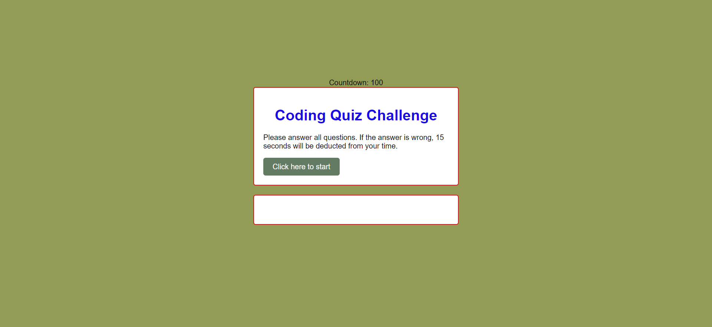

# quiz-code

## Discription
This is a coding quiz challenge project developed as part of a bootcamp curriculum. The quiz presents a series of multiple-choice questions related to programming concepts and measures your knowledge and speed in answering them. You will earn points for correct answers and lose time for incorrect answers.

[vist the Deployed Site](https://ssherp.github.io/quiz-code/)

## Usage

## Features
•   Multiple-choice questions with a time limit
•   Score tracking
•	High scores leaderboard
•	Ability to submit initials and store high scores
•	Start the game over and clear high scores

## Technologies 
•	HTML
•	CSS
•	JavaScript

## Getting Started
To run the coding quiz challenge, simply open the index.html file in your web browser.

## How to Play
1.	Click on the "Click here to start" button to begin the quiz.
2.	Read each question carefully and choose the correct answer by clicking on one of the provided choices.
3.	If your answer is correct, you will earn points. If your answer is incorrect, time will be deducted from the timer.
4.	Answer all the questions within the time limit to maximize your score.
5.	At the end of the quiz, you can enter your initials to submit your score and view the high scores leaderboard.
6.	You can start the game over by clicking the "Start Over" button.
7.	To clear the high scores, click the "Clear Scores" button.

## Learning Points
Through this project, you will gain the following learning points:
•	Understanding and implementing JavaScript logic for a quiz game
•	Working with HTML to create the quiz interface and structure
•	Styling the quiz using CSS to enhance the user experience
•	Handling events and user interactions with JavaScript event listeners
•	Using timers to create a countdown and manage game flow
•	Storing data in the browser's local storage to persist high scores
•	Dynamically generating and updating the quiz questions and choices
•	Implementing a leaderboard to display high scores
•	Enhancing the user interface by providing options to start the game over and clear scores

## Sonam Sherpa

* [Linkedin](https://www.linkedin.com/in/sonam-sherpa-306559280)
* [Github](https://github.com/ssherp/)